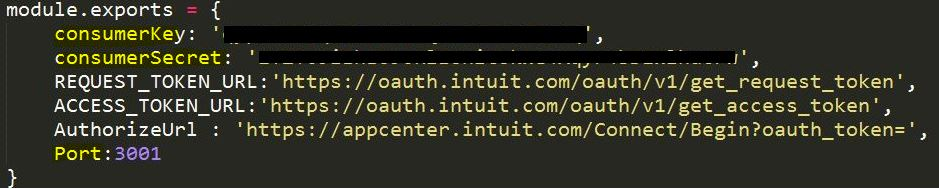
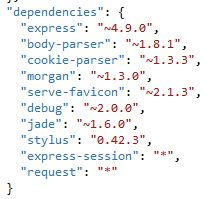
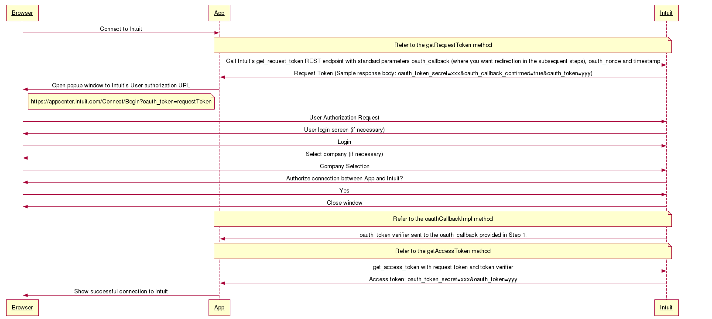
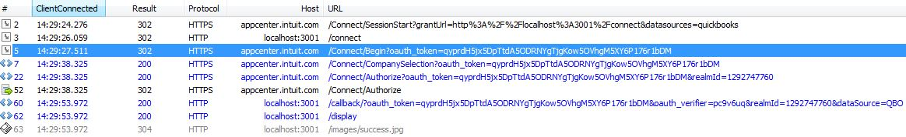
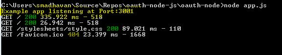
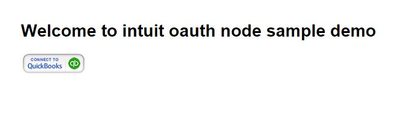
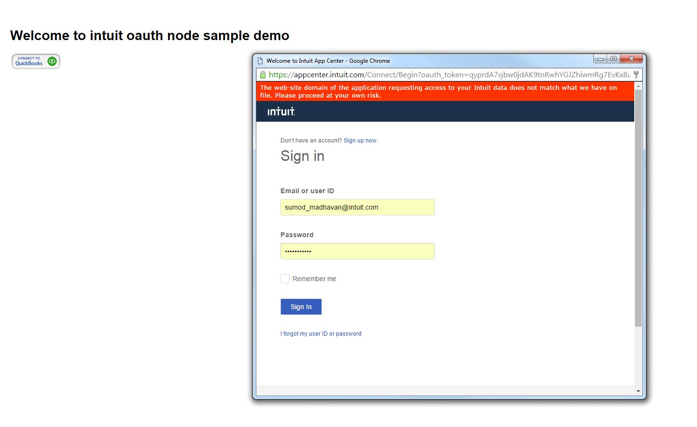
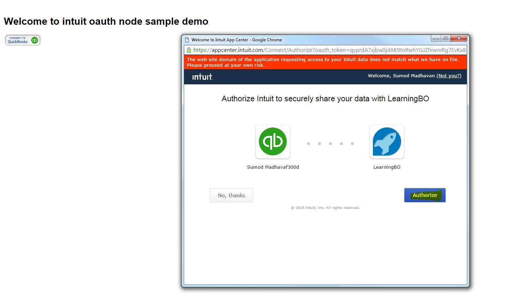
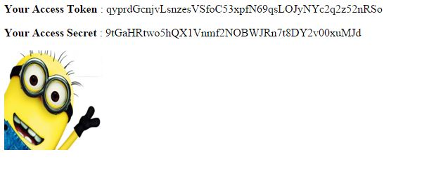

#NODE JS Sample App for OAuth
=====================================

Welcome to the Intuit Developer's Node JS OAuth Sample App.

This sample app is meant to provide a working example of oAuth management.

OAuth Management APIs consists of the following:

<ul>
<li>Intuit OAuth Service URLs - URLs to use to access Intuit OAuth Services.</li>
<li>Request token URL - Request token endpoint to retrieve request token and secret</li> 
<li>Access token URL - Access token endpoint to retrieve access token and secret </li>
<li>Authorize URL - To authorize access to the third party app</li>
</ul>

This is not a seed project to be taken cart blanche and deployed to your production environment. Certain concerns are not addressed at all in our samples (e.g. security, privacy, scalability). In our sample apps, we strive to strike a balance between clarity, maintainability, and performance where we can. However, clarity is ultimately the most important quality in a sample app.

## Table of Contents

* [Prerequisites](#prerequisites)
* [First Use Instructions](#first-use-instructions)
* [Running the app](#running-the-app)
* [Project Structure](#project-structure)

## Prerequisites

1. 
2. Developer.intuit.com account
3. An app on developer.intuit.com and the associated app token, consumer key, and consumer secret.

## Configuration

## Dependencies

## First Use Instructions:

- Clone the GitHub repo to your workspace

  Note: This sample is used for understanding how oauth works

- Configure the app tokens: Go to your app on developer.intuit.com and copy the OAuth Consumer Key and OAuth Consumer Token from the keys tab. Add these values to the file node_modules\app\config.js in our oauth-node folder.

- Make sure you specify a port which is not used.

- Run npm install to make sure all the dependencies are installed from package.json

## Run the App:

Once the sample app code is on your computer, follow the steps below to run the app:

- Run the command **node app.js** 

- Go to Browser -> localhost:3001 -> Enter

- Connect your app to Quickbooks, by clicking on Connect to QuickBooks button and follow the instructions on the screen.

- After successfully connecting the app to QuickBooks.

- You shous view the access token and access secret. 

**Refer : Screen Shots**

## How Oauth Works:

- The following simple sequence diagram should help you understand the flow.

## Understanding the http flow:

- Your http request flow should look like this.

## How does your SSL handshake look:

- Make sure you have your port 443 open for SSL handshake to commit to intuit server.

## Screen Shots

**Listener**

**Index**

**Connect**

**Authorize**

**Access Tokens**

## Feedback

Your feed back is appreciated and it will motivate us to improve the app. Please send your valuable feedback to sumod_madhavan@intuit.com. I will try my best to incorporate the valid requests.
 
## Contributing to the Repository ###

If you find any issues or opportunities for improving this respository, fix them!  Feel free to contribute to this project by [forking](http://help.github.com/fork-a-repo/) this repository and make changes to the content.  Once you've made your changes, share them back with the community by sending a pull request. Please see [How to send pull requests](http://help.github.com/send-pull-requests/) for more information about contributing to Github projects. Please help in writing test cases to the Test Project.

## Reporting Issues ###

If you find any issues with this demo that you can't fix, feel free to report them in the issue section of this repository.

